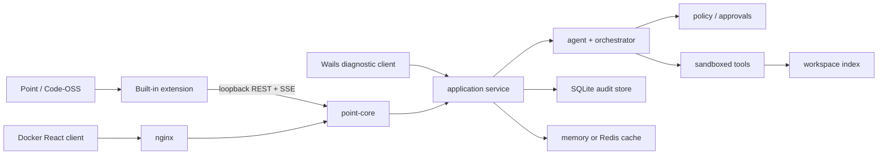

# Point IDE

Point — самостоятельная Windows IDE на базе Code-OSS с локальным агентным
ядром. Редактор, терминал, Git, debugger, Open VSX, русская оболочка и Agent Hub
поставляются одним приложением; установленный VS Code и Microsoft account не
требуются.

Текущая версия Point — `1.2.2`, Code-OSS — `1.124.2`. Agent Hub использует
2-шаговый онбординг: подключение (или встроенный движок Point) → правила
Мастера. Companion и постоянные агенты настраиваются позже и не блокируют
первый запрос; Мастер предлагает нужный ростер в карточке запуска.

## Что здесь чем является

- **Point / Code-OSS + встроенное расширение** — канонический продукт. Всё, что
  описано ниже как работающее, работает здесь.
- **`point-core`** — локальное ядро на Go. Поднимается расширением само, на
  случайном loopback-порту, и без него IDE остаётся обычным редактором.
- **Wails-клиент (`frontend/`)** — диагностический, не имеет паритета
  возможностей с Agent Hub и нужен для отладки слоя `internal/app`.
- **Docker web client** — тот же слой в браузере, для проверки на другой машине.
- **Legacy-контур** (`/api/quest-proposals/*`, `/api/change-sets/*`,
  `/api/workflows/*`, `/api/flows/*`) сохранён как совместимость; продуктовый
  путь идёт через WorkOrder v2 и Мастера — см.
  [legacy-lifecycle.md](docs/legacy-lifecycle.md).

## Быстрый старт

### Из чистого клона

Репозиторий хранит только исходники. Собранного вебвью (`media/main.js`,
`media/style.css`), `node_modules`, `vscode-extension/bin/`,
`vscode-extension/dist/` и `frontend/dist/` в нём нет — первым делом их надо
получить, иначе не запустится ни одна проверка.

Требования: **Go 1.25+** (граница в `go.mod`), **Node 24** (CI выбирает major
`24`, сборочный runtime закреплён в `distribution/version.json`) и **Windows
x64** — packaged Cursor runtime собран только под неё.

```powershell
go build ./...
node scripts/build-core.mjs
Push-Location vscode-extension
npm ci
npm run build
Pop-Location
```

`build-core.mjs` кладёт `point-core.exe` и `point-db.exe` в
`vscode-extension/bin/`; `npm run build` собирает CSS, вебвью и runtime
расширения. После этого дерево живо, и это можно проверить, не собирая IDE:

```powershell
node scripts/run-hub-smokes.mjs
```

62 сценария Хаба поднимают настоящее ядро и исполняют собранный
`media/main.js`. Полный прогон — `npm run check` в `vscode-extension` (см.
раздел «Проверка»). Само приложение собирается отдельным долгим шагом:
порядок в [distribution/README.md](distribution/README.md). Куда смотреть
дальше — [индекс документации](docs/README.md).

### Готовая Windows IDE

Собранных приложений и установщиков репозиторий не хранит: они воспроизводятся
из исходников и остаются в игнорируемом `build/`. Порядок полной сборки описан в
[distribution/README.md](distribution/README.md).

После сборки получаются две разные копии, и их легко перепутать:

- portable — `.cache/VSCode-win32-x64/Point.exe` (рабочее дерево Code-OSS);
- установленная — `%LOCALAPPDATA%\Programs\Point`.

Выкладка не в ту копию выглядит как «починка не помогла», поэтому перед проверкой
изменений убедитесь, какую копию запускаете.

Point открывает локальный core только для доверенной `file:`-папки. В multi-root
workspace `Ctrl+Alt+P` выбирает один активный корень Point; соседние roots
остаются доступны редактору. Разные проекты можно держать параллельно в разных
окнах.

Полная воспроизводимая сборка описана в
[distribution/README.md](distribution/README.md).

### Разработка встроенного расширения

Требования те же, что у чистого клона. `npm run check` сам пересобирает ядро
перед интеграционными смоуками, поэтому Go обязан быть в `PATH`.

```powershell
Push-Location vscode-extension
npm run check
npm run package
Pop-Location
```

VSIX создаётся в `build/vsix/point-ide-1.2.2.vsix`. Production-дистрибутив уже
содержит расширение и лениво запускает `point-core.exe` на случайном loopback-порту.

### Docker web client

Docker-маршрут монтирует один host-каталог как `/workspace` и публикует только
nginx на host loopback. По умолчанию используется тестовый проект
`examples/go-health`.

```powershell
Copy-Item .env.example .env
docker compose up -d --build
```

Откройте <http://127.0.0.1:8080>. Для другого проекта задайте абсолютный
`WORKSPACE_PATH`; для другого порта — `WORKBENCH_PORT`. Значение
`POINT_API_TOKEN` из примера предназначено только для локальной разработки и
должно быть заменено при любом совместно используемом окружении.

### Wails diagnostic client

`frontend/src` — официальный диагностический клиент use-case слоя: дерево файлов, Monaco,
команда терминала и базовый onboarding. Он полезен для Wails-разработки, но не
имеет feature parity с каноническим Code-OSS Agent Hub.

```powershell
Push-Location frontend
npm ci
npm run build
Pop-Location
wails dev
```

Production-сборка: `wails build -platform windows/amd64` или `make build-desktop`.

## Архитектура



Канонический продуктовый UI — built-in Code-OSS extension. Wails и Docker
используют тот же transport-independent слой `internal/app`, но предоставляют
облегчённый интерфейс.

Ключевые каталоги:

- `internal/agent` — ограниченный agent loop, контекст и approvals;
- `internal/app` — use cases Agent Hub, runs, flows и change sets;
- `internal/workspace` — граница путей, поиск и локальный индекс;
- `internal/tools` — встроенные и пользовательские инструменты;
- `internal/storage` — SQLite, миграции и immutable history;
- `internal/httpapi` — REST/SSE adapter;
- `vscode-extension/ui` — редактируемые источники Hub UI;
- `vscode-extension/media` — генерируемые webview bundles;
- `distribution` — закреплённый Code-OSS overlay и installer.

Подробнее: [архитектура](docs/architecture.md),
[модель безопасности](docs/security.md), [HTTP API](docs/api.md) и
[lifecycle совместимости](docs/legacy-lifecycle.md),
[backup/restore runbook](docs/operations.md),
[performance SLO](docs/performance.md), а также
[индекс всей документации](docs/README.md).

## Безопасность в одном абзаце

Обычный agent execution работает в filtered copy или detached Git worktree;
live workspace меняется только после review/apply Change Set. Patch требует
предварительного осмотра, SHA-256 и approval. Команды и process-tools требуют
отдельного подтверждения, выполняются с ограниченной средой и журналируются.
Production-конфигурация направляет их в version-attributed Docker backend с
единственным workspace mount, read-only root и лимитами ресурсов. Сеть по
умолчанию отсутствует; точный TLS FQDN/port allowlist исполняет отдельный
gateway с pinned public DNS, проверкой SNI и квотами. Локальный
filtered-copy backend остаётся явно помеченным compatibility/dev-режимом.
Подробнее: [execution sandbox](docs/sandbox.md).

## Проверка

Быстрый локальный gate:

```powershell
node scripts/check-docs.mjs
node scripts/check-release-contracts.mjs
go test ./...
go vet ./...

Push-Location frontend
npm run build
Pop-Location

Push-Location vscode-extension
npm run check
Pop-Location

docker compose config
```

Windows/Electron E2E и installer smoke перечислены в
[IDE-CAPABILITY-MATRIX.md](docs/IDE-CAPABILITY-MATRIX.md). Правила изменения
проекта — в [CONTRIBUTING.md](CONTRIBUTING.md).

То же самое гоняет CI на каждый push в `main`/`master` и на каждый pull
request — [`.github/workflows/ci.yml`](.github/workflows/ci.yml), пять
независимых job:

| Job | Где | Что проверяет |
| --- | --- | --- |
| `docs` | ubuntu | Три затвора документации: битые ссылки, паритет `docs/api.md` с маршрутами `internal/httpapi`, единая версия, реестр дефектов |
| `go` | ubuntu | `go vet`, `go mod verify` (подмена зависимости), `go test ./...` |
| `sandbox` | ubuntu | Сборка образа песочницы, CycloneDX SBOM, отказ на любом HIGH/CRITICAL от Trivy и живой тест изоляции в настоящем Docker |
| `frontend` | ubuntu | Сборка диагностического клиента и `npm audit` |
| `extension` | **windows** | `npm run check` целиком: свежий `point-core`, сборка CSS/JS/runtime, контракты дизайн-системы, ~35 `node --check`, 62 смоука Хаба |

Windows у `extension` не прихоть: расширение поставляется с packaged Cursor
runtime под win32-x64, а часть смоуков про терминал, SSH и пути на Linux
бессмысленна. `sandbox` — единственное место, где изоляция проверяется
настоящим Docker: локально этот тест требует `POINT_SANDBOX_DOCKER_TEST=1` и
собранного образа и потому обычно не запускается.

Главное, чего локальный прогон дать не может: CI работает на **чистом
клоне**. Собранный вебвью, `node_modules`, `bin/` и `dist/` в репозиторий не
входят, а большинство смоуков Хаба исполняет именно собранный
`media/main.js` — если в репозитории не хватит исходника, это увидит CI, а не
рабочая машина с готовыми артефактами. Точное число смоуков — одно, в
`scripts/run-hub-smokes.mjs`; второго счёта рядом быть не должно.

## Текущее состояние

Проект предназначен для личного использования. Актуальные проверки и оставшиеся возможности описаны в [PROJECT-STATUS.md](docs/PROJECT-STATUS.md), воспроизведение и закрытие ошибок — в [аудите](docs/AUDIT-2026-09-05.md).

С 13 сентября работа идёт через контур v2: Мастер собирает **карточку запуска** (WorkOrder) — цель, границы, критерии приёмки, ростер, бюджет и политику доставки, — человек утверждает её целиком, и только после этого запускается исполнение. Завершение не следует из успеха Flow: квест закрывается лишь через шлюз доказательств, а доставка подтверждается распиской. Подробнее — [PROJECT-STATUS.md](docs/PROJECT-STATUS.md) и [architecture.md](docs/architecture.md). Контур v2 собран в portable-копии `.cache/VSCode-win32-x64`; установленная копия может отставать — сверяйте дату перед проверкой.

Extension npm run check теперь сам собирает свежие point-core и point-db перед интеграционными smoke; Go должен быть доступен в PATH. Source-only проверка навигации входит в check, полная проверка грамматик запускается отдельно при наличии дерева Code-OSS.

Signing и формальная публичная release-приёмка не требуются для текущей личной цели. Для сохранности собственных данных остаются важны backup/restore, проверка актуальности запускаемой копии и явное подтверждение записывающих действий.

## Лицензия

MIT — см. [LICENSE](LICENSE). Тот же текст лежит в
[vscode-extension/LICENSE](vscode-extension/LICENSE): он едет в VSIX и обязан
быть рядом с расширением.
